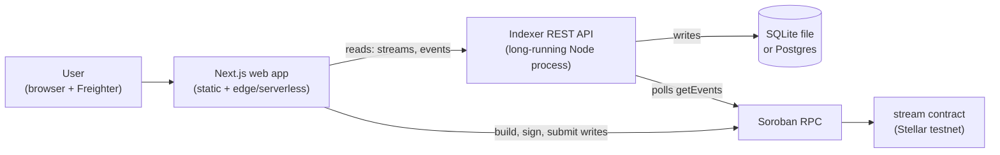

# Deployment topology

The application layer is three pieces with very different hosting needs. Put
each on a platform built for it rather than forcing all three onto one.

## What runs where

Two paths leave the browser:

- **Reads** go to the indexer's REST API so the dashboard can list streams
  without scanning every id on-chain.
- **Writes** (`create_stream`, `withdraw`, `cancel`) go straight to Soroban
  RPC, signed in Freighter. They do not pass through the indexer.

The indexer later observes those same writes as events and caches them.

## Frontend (`apps/web`)

A standard Next.js app. A platform purpose-built for Next.js (Vercel) is the
default choice. Requirements:

- **Root directory:** `apps/web` (or the repo root if the platform detects the
  pnpm workspace).
- **Build command:** `pnpm build` (or `pnpm --filter web build`).
- **Output:** managed by Next.js.
- **Environment:** the `NEXT_PUBLIC_*` values from
  [Environment variables](environment.md).

!!! warning "`NEXT_PUBLIC_*` is inlined at build time"
    Next.js bakes these values into the bundle during `next build`. Setting them
    only at runtime has no effect — set them in the platform's environment, then
    **redeploy**. This is the usual cause of an app that still calls
    `localhost:3001` in production.

## Indexer (`indexer`)

A long-running Node process with a database, not a serverless function. Use a
platform that keeps a process alive (Render, Fly.io, Railway). Requirements:

- **Root directory:** `indexer`.
- **Build command:** `pnpm install && pnpm --filter indexer build` (or
  `pnpm build` at the root).
- **Start command:** `pnpm --filter indexer start` → `node dist/server.js`.
- **Health check:** `GET /health` returns the current `lastLedger`, so the
  platform can confirm it is syncing and not just listening.
- **Environment:** `STREAM_CONTRACT_ID`, `SOROBAN_RPC_URL`,
  `STELLAR_NETWORK_PASSPHRASE`, and `DB_PATH` (or a database URL).
- **Persistent disk:** the SQLite file must survive restarts, or the index is
  rebuilt from the start ledger each time. Attach a disk, or move to Postgres
  (tracked as an issue).

Once deployed, set the frontend's `NEXT_PUBLIC_INDEXER_URL` to the indexer's
public URL and redeploy the frontend.

## Database

SQLite is fine for the indexer co-located on a host with a persistent disk. A
managed Postgres is the durable alternative for stateless hosts. Whichever you
choose, keep it in the **same region** as the indexer so reads are not
round-tripping across continents.

## Wiring it together

The single value that must agree across services is the **stream contract id**:

| Service | Variable |
| --- | --- |
| Frontend | `NEXT_PUBLIC_STREAM_CONTRACT_ID` |
| Indexer | `STREAM_CONTRACT_ID` |

Both must also target the **same network** (`SOROBAN_RPC_URL` and
`STELLAR_NETWORK_PASSPHRASE`). A frontend on testnet talking to an indexer
configured for a different contract will show an empty or wrong list; a
frontend signing for a different network than Freighter is set to will fail at
submission.

## Common failure: the frontend still calls localhost

If the deployed app cannot reach the indexer:

1. Confirm `NEXT_PUBLIC_INDEXER_URL` is set in the **hosting platform**, not
   just locally.
2. Confirm the value is the indexer's public HTTPS URL, and that the indexer
   allows the frontend's origin (it enables CORS for all origins by default).
3. **Redeploy the frontend.** Changing a `NEXT_PUBLIC_*` value without a rebuild
   leaves the old value inlined in the bundle.

## Deploying the contract first

The contract must be deployed before the app can do anything on-chain. See the
contracts repo's
[deployment guide](https://github.com/Deyanju23/stellar-stream-contract/blob/main/docs/DEPLOYMENT.md);
it prints `STREAM_CONTRACT_ID`, which fills in the table above.
